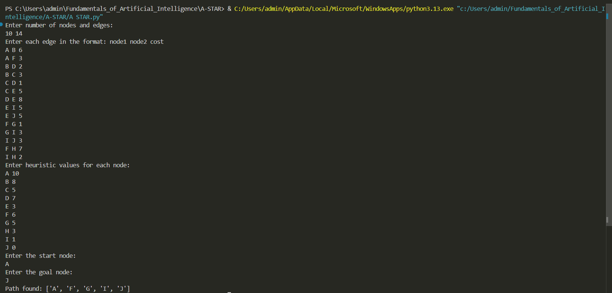

<h1>ExpNo 4 : Implement A* search algorithm for a Graph</h1> 
<h3>Name: VENKATANATHAN P R</h3>
<h3>Register Number: 212223240173</h3>
<H3>Aim:</H3>
<p>To ImplementA * Search algorithm for a Graph using Python 3.</p>
<H3>Algorithm:</H3>

``````
// A* Search Algorithm
1.  Initialize the open list
2.  Initialize the closed list
    put the starting node on the open 
    list (you can leave its f at zero)

3.  while the open list is not empty
    a) find the node with the least f on 
       the open list, call it "q"

    b) pop q off the open list
  
    c) generate q's 8 successors and set their 
       parents to q
   
    d) for each successor
        i) if successor is the goal, stop search
        
        ii) else, compute both g and h for successor
          successor.g = q.g + distance between 
                              successor and q
          successor.h = distance from goal to 
          successor (This can be done using many 
          ways, we will discuss three heuristics- 
          Manhattan, Diagonal and Euclidean 
          Heuristics)
          
          successor.f = successor.g + successor.h

        iii) if a node with the same position as 
            successor is in the OPEN list which has a 
           lower f than successor, skip this successor

        iV) if a node with the same position as 
            successor  is in the CLOSED list which has
            a lower f than successor, skip this successor
            otherwise, add  the node to the open list
     end (for loop)
  
    e) push q on the closed list
    end (while loop)

``````

<hr>

<h3>Program:</h3>

```python
from collections import defaultdict

H_dist = {}

def aStarAlgo(start_node, stop_node):
    open_set = set([start_node])
    closed_set = set()
    g = {}
    parents = {}
    g[start_node] = 0
    parents[start_node] = start_node

    while open_set:
        n = None
        for v in open_set:
            if n is None or g[v] + heuristic(v) < g[n] + heuristic(n):
                n = v

        if n is None:
            print("Path does not exist!")
            return None

        if n == stop_node:
            path = []
            while parents[n] != n:
                path.append(n)
                n = parents[n]
            path.append(start_node)
            path.reverse()
            print("Path found:", path)
            return path

        for (m, weight) in get_neighbors(n):
            if m not in open_set and m not in closed_set:
                open_set.add(m)
                parents[m] = n
                g[m] = g[n] + weight
            elif g[m] > g[n] + weight:
                g[m] = g[n] + weight
                parents[m] = n
                if m in closed_set:
                    closed_set.remove(m)
                    open_set.add(m)

        open_set.remove(n)
        closed_set.add(n)

    print("Path does not exist!")
    return None

def get_neighbors(v):
    return Graph_nodes.get(v, [])

def heuristic(n):
    return H_dist[n]

# --- INPUT SECTION WITH PROMPTS ---
graph = defaultdict(list)

print("Enter number of nodes and edges:")
n, e = map(int, input().split())

print("Enter each edge in the format: node1 node2 cost")
for i in range(e):
    u, v, cost = input().split()
    cost = int(cost)
    graph[u].append((v, cost))
    graph[v].append((u, cost))  # For undirected graph

print("Enter heuristic values for each node:")
for i in range(n):
    node, h = input().split()
    H_dist[node] = int(h)

Graph_nodes = graph

print("Enter the start node:")
start = input()

print("Enter the goal node:")
goal = input()

# --- RUN A* ---
aStarAlgo(start, goal)
```

<HR>

<h2>Sample Graph I</h2>
<hr>


<hr>


<h2>Sample Input</h2>
<hr>
10 14 <br>
A B 6 <br>
A F 3 <br>
B D 2 <br>
B C 3 <br>
C D 1 <br>
C E 5 <br>
D E 8 <br>
E I 5 <br>
E J 5 <br>
F G 1 <br>
G I 3 <br>
I J 3 <br>
F H 7 <br>
I H 2 <br>
A 10 <br>
B 8 <br>
C 5 <br>
D 7 <br>
E 3 <br>
F 6 <br>
G 5 <br>
H 3 <br>
I 1 <br>
J 0 <br>
<hr>
<h2>Sample Output</h2>
<hr>
Path found: ['A', 'F', 'G', 'I', 'J']


<hr>
<h2>Sample Graph II</h2>
<hr>


<hr>
<h2>Sample Input</h2>
<hr>
6 6 <br>
A B 2 <br>
B C 1 <br>
A E 3 <br>
B G 9 <br>
E D 6 <br>
D G 1 <br>
A 11 <br>
B 6 <br>
C 99 <br>
E 7 <br>
D 1 <br>
G 0 <br>
<hr>
<h2>Sample Output</h2>
<hr>
Path found: ['A', 'E', 'D', 'G']

<h3>Original Output</h3>




<h3>Result:</h3>
<hr>

Thus a graph was constructed and implemantation of A star Search for the same graph was done successfully.